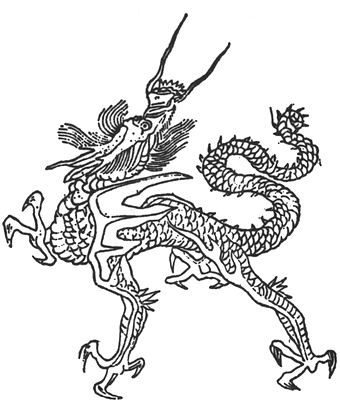

```{r setup, include=FALSE}
###markdown Setup
knitr::opts_chunk$set(echo = TRUE)
```
## Dragons of choice


"Yinglong" By: WenHuan Hu ~1596
https://en.wikipedia.org/wiki/Yinglong


"The Dragon Club" By: Disney Channel
https://movie.douban.com/subject/26613425/?from=subject-page


"Plain Yellow Banner" By: Unknown Author ~1600
https://en.wikipedia.org/wiki/Plain_Yellow_Banner

```{r}
library(ape)## load ape library

### Weights
WeightsDat<-read.csv("./Weights.csv")## import weights
# create a single vector of weights
Weights<-paste0(WeightsDat$Weight,collapse="")##create weight vector by pasting the weight column. seperate the result by ""
Weights<-strsplit(Weights,split="")[[1]]#split the strings into substrings [[1]] return a single element of the list

## convert each letter to a value 
WeightsNum<-rep(NA,length(Weights))# create a new vector "WeightsNum, repeating the 
for(i in 1:length(WeightsNum)){# create a for loop moving along the length of WeightsNum
  if(Weights[i] %in% LETTERS){# if elements of WeightsNum in the Weights column is a LETTER 
    WeightsNum[i]<-which(LETTERS==Weights[i])+9#then the weight would be the set position of the letter +9. ex B=2+9=11
  } else { #if Weight[i] is not a letter
    WeightsNum[i]<-Weights[i]# the weight would be the number
  }
}
WeightsNum<-as.numeric(WeightsNum)#update WeightsNum containing the weight of each row in row in numbers 
```

```{r}
## Multiply the Weight value by the trait vector for each dragon 
WtDragonNexus<-read.nexus.data("./DragonMatrix.nex")##load the nex file from directory 
for (i in 1:length(WtDragonNexus)){# loop along the length of the new weighted data frame object 
  RepWeight<-WtDragonNexus[[i]]==1 #replace 1s with their corresponding weight value by slicing our list object using [[i]]
  WtDragonNexus[[i]][RepWeight]<-WeightsNum[RepWeight]
  RepWeight<-NA #to ignore the ? 
}


## Re-calculate distance matrix 
WtDragonNexusDF<-data.frame(matrix(unlist(WtDragonNexus),ncol=78,byrow=T))# create matrix by unlisting 
row.names(WtDragonNexusDF)<-names(WtDragonNexus)#make the name of each entry as the row name 
WtDragonDist<-dist(WtDragonNexusDF,method='euclidean')## calculate distance by euclidean
WtDragonDistMat<-as.matrix(WtDragonDist)# generate matrix 

```

```{r}
### Visualization 
library(ggtree)## load the ggtree library 
WtDragonTree<-fastme.bal(WtDragonDist)## generate tree with distance matrix 

## color coding tree
Country<-gsub("[0-9\\.]+([^X]+)X*","\\1",WtDragonTree$tip.label) # Remove leading numbers


CountryGroups<-split(WtDragonTree$tip.label, Country)# group tips.label (species name) by country using split 
WtDTcol<-groupOTU(WtDragonTree,CountryGroups)#use groupOTU to apply grouping information 


p <- ggtree(WtDTcol, layout="circular") +## construct ggtree using the newly grouped information WtDToll
  geom_tiplab(size=2, aes(angle=angle))

groupOTU(p, c(40,41,42)) + ##apply group functioning with the 
  aes(colour = group) + ##group by color 
  scale_color_manual(values = c("black", "red"))## highlight by black and red 


```
